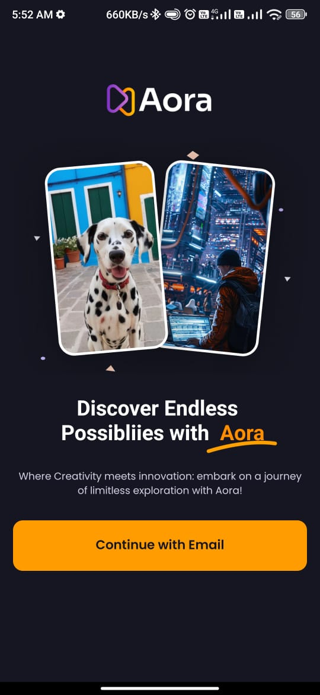
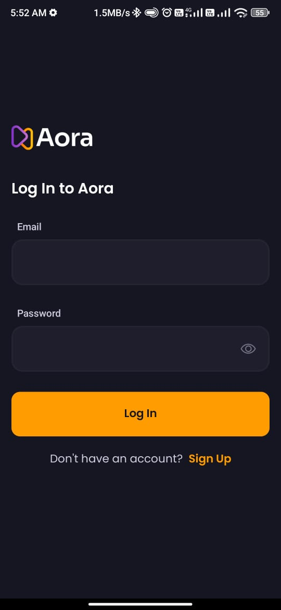
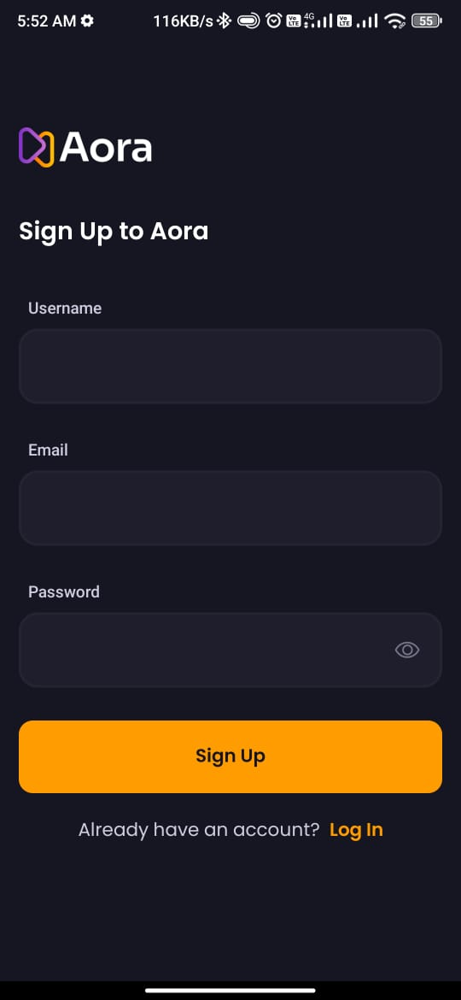
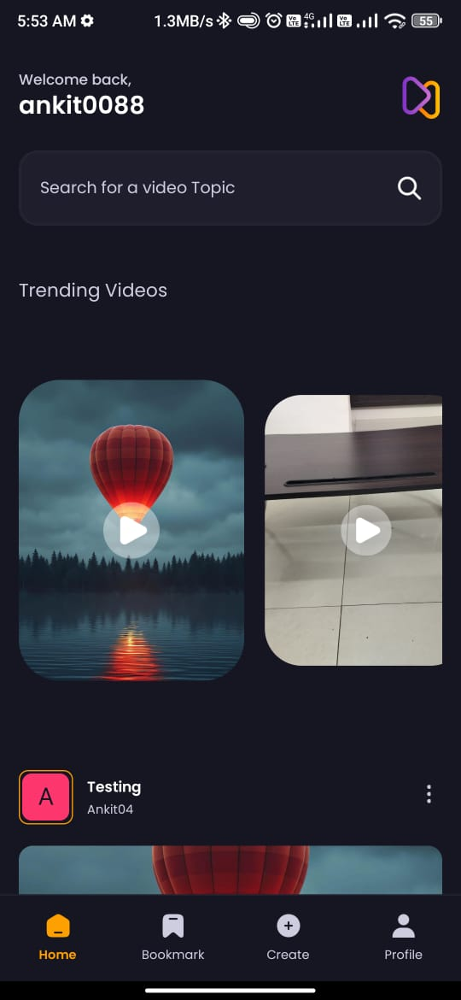
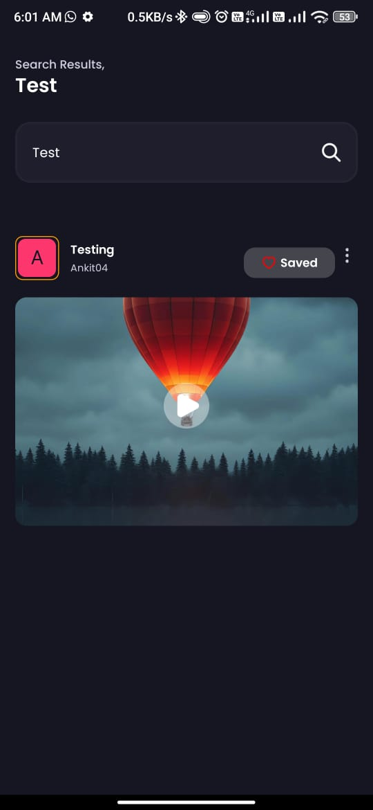
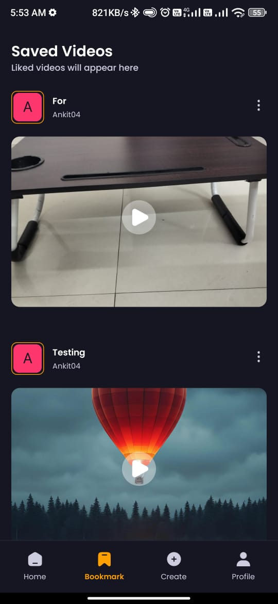

# Aora

Aora is a creative platform built with React Native where users can create accounts, sign in, sign out, upload video posts, save posts, view their profile, and explore other users' posts. The app leverages a modern tech stack, including React Animation, Expo Router, Expo AV, and NativeWind for styling. The backend services, including database and storage, are powered by Appwrite.

## Features

- **User Authentication**: Sign Up, Log In, Log Out
- **Home Page**: View recent and trending posts
- **Search Page**: Find posts and users by keywords
- **Bookmark**: Save posts for later viewing
- **Profile Management**: View and edit user profiles
- **Create Post**: Upload and share video posts
- **Explore Posts**: Browse and engage with other users' content

## Screenshots

### Welcome, Login, and Sign Up Screens

<p float="left">
  
  
  
</p>

### Home, Search, and Bookmark Pages

<p float="left">
  
  
  
</p>

### Profile and Create Post Pages

<p float="left">
  
  
</p>

## Tech Stack

- **React Native**: For building the mobile app.
- **React Animation**: To add animations and enhance user experience.
- **Expo Router**: For navigation within the app.
- **Expo AV**: For handling audio and video functionalities.
- **NativeWind (Tailwind)**: For styling the application with Tailwind CSS utilities.
- **Appwrite**: For database and storage management.

## Getting Started

To get a local copy up and running, follow these steps.

### Prerequisites

Ensure you have the following installed:

- Node.js
- Expo CLI

### Installation

1. Clone the repository
    ```sh
    git clone https://github.com/ankitkr-04/aora.git
    ```
2. Navigate to the project directory
    ```sh
    cd aora
    ```
3. Install dependencies
    ```sh
    npm install
    ```
4. Start the Expo server
    ```sh
    expo start
    ```

## Usage

1. Open the Expo Go app on your device or an emulator.
2. Scan the QR code generated by the Expo server.

## Contributing

Contributions are what make the open-source community such an amazing place to learn, inspire, and create. Any contributions you make are **greatly appreciated**.

1. Fork the Project
2. Create your Feature Branch (`git checkout -b feature/AmazingFeature`)
3. Commit your Changes (`git commit -m 'Add some AmazingFeature'`)
4. Push to the Branch (`git push origin feature/AmazingFeature`)
5. Open a Pull Request

## License

Distributed under the MIT License. See `LICENSE` for more information.

## Contact

Ankit Kumar - [@AnkitKr_04](https://twitter.com/AnkitKr_04)

Project Link: [https://github.com/ankitkr-04/aora](https://github.com/ankitkr-04/aora)

## Connect with me

- [GitHub](https://github.com/ankitkr-04)
- [Twitter](https://twitter.com/AnkitKr_04)
- [LinkedIn](https://www.linkedin.com/in/ankit-kumar-2143412a3/)
